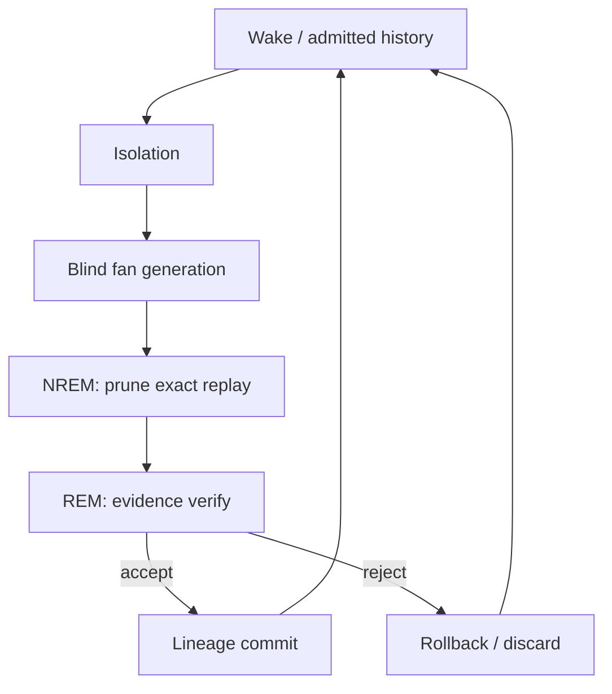

# Sovereign CKK: Agency = Fan + Sleep

## Identity boundary

CKK now keeps three identities separate:

1. `structural_sig()` is L0-L3 morphology: equal present attributes may share a
   quotient node.
2. Recursive `Struct.sig()` preserves the construction tree embedded in a
   snapshot, but it is not complete history. A dual round-trip proves the limit:
   `op_dual(op_dual(X)).sig() == X.sig()`.
3. `Candidate.lineage_id` is L4 ontological hysteresis: an append-only hash of
   operator, parent lineages and resulting morphology. Equal snapshots reached
   through different events remain different individuals.

Therefore structural confluence does not imply identity fusion. It is a class
of morphologically equal histories.

## Cycle

## Contracts

| Phase | May read evidence | May alter cache | May alter admitted history |
| --- | ---: | ---: | ---: |
| Isolation / generation | No | Yes | No |
| NREM | No | Yes, exact replay only | No |
| REM | Yes | Verdict/evidence only | No |
| Explicit commit | Verified evidence only | Status only | Append only |

The grammar remains write-locked throughout. A candidate can be `PENDING`,
`VERIFIED`, `REJECTED`, or `COMMITTED`. `PENDING` proposals are dream artifacts:
they are not discoveries and cannot enter L4 until verification and admission.

## Minimal executable surface

`ckk_snapshot/ckk/sovereign/architecture.py` implements the state machine.
`test/test_sovereign_architecture.py` demonstrates:

- evidence-blind generation,
- non-merging equal morphologies with different histories,
- exact-replay pruning,
- write-locked rejection,
- append-only lineage commits,
- cache disposal without identity loss.

This layer does not reinterpret the sealed Run 34 counts. It supplies the
previously missing future path from current derivational candidates to audited,
non-mergeable L4 admissions.
